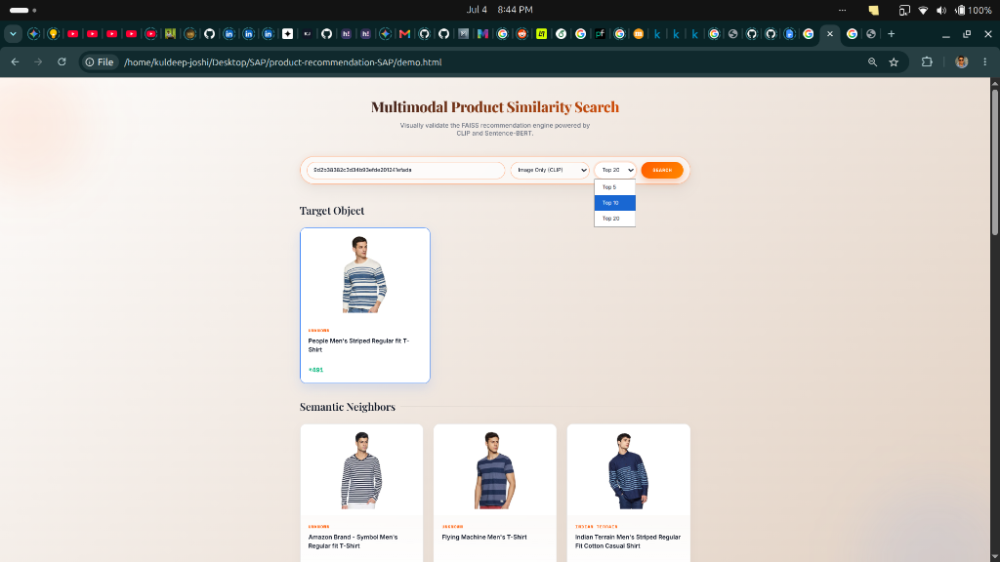
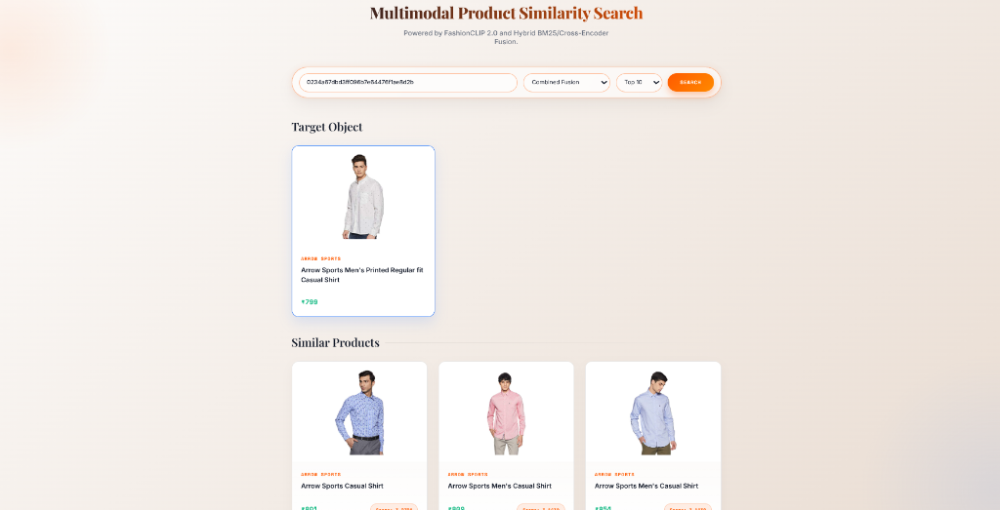
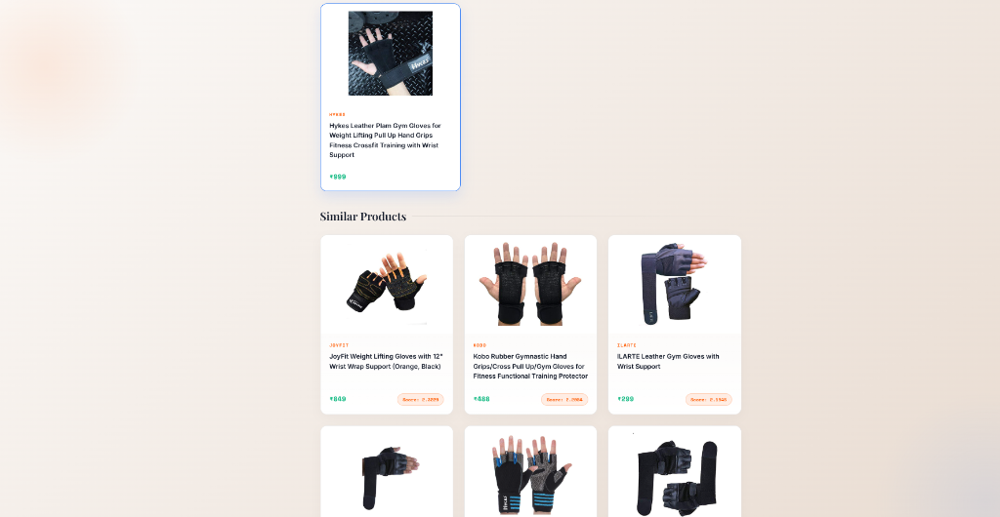
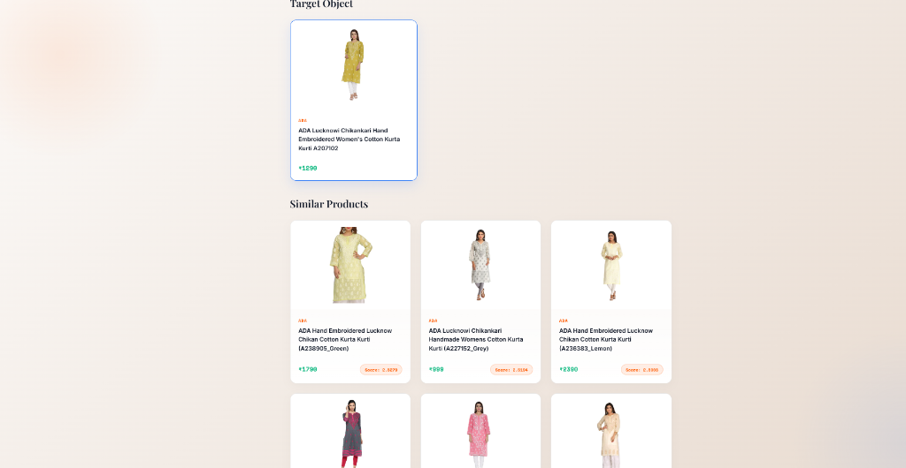

# SAP Product Recommendation Engine (Technical Exercise)

This repository contains my submission for the SAP CX II Technical Exercise. I have built a **Multimodal Product Similarity Search Engine** leveraging a Hybrid Retrieval architecture (Dense FAISS + Sparse BM25 + FashionCLIP Visual Embeddings + Cross-Encoder Reranking).

---

## 1. Project Deliverables

### The Core Function
The core similarity search algorithm requested in the assignment is located in `similarity_search.py`. It handles FAISS HNSW querying, Reciprocal Rank Fusion, and Cross-Encoder re-ranking to provide similar products, comparable to main stream e-commerce search engines like amazon etc.
```python
from similarity_search import ProductSimilaritySearch

search = ProductSimilaritySearch()
search.load("indices")
similar_products = search.find_similar_products("3a92218968565a0b5a1900a6eefd309f", num_similar=10, mode="combined")
```

### The Microservice API
The solution is deployed via a FastAPI microservice (`app.py`), fulfilling Part 2 of the prompt. FastAPI automatically generates Swagger documentation.

**Interactive API Testing:**
Once the server is running, navigate to **[http://localhost:8000/docs](http://localhost:8000/docs)** to view the interactive Swagger UI and test the endpoints directly from your browser.

**Core Endpoint 1:** `GET /find_similar_products`
Returns a flat list of similar Product IDs.
**Parameters:**
- `product_id` (str, required): The unique ID of the target product.
- `num_similar` (int, required): Number of recommendations to return (must be between 1 and 50). No default, must be explicitly provided.
- `mode` (str, optional): Configurable search logic. Options are `text_structured`, `image`, or `combined`. Default is `text_structured`.

**Core Endpoint 2:** `GET /find_similar_products_detailed`
Returns a JSON object containing the full metadata (name, brand, price, image URL) of the query product and all similar products, along with their similarity scores.
**Parameters:**
- `product_id` (str, required): The unique ID of the target product.
- `num_similar` (int, optional): Number of recommendations to return. Default is `10`.
- `mode` (str, optional): Search logic. Default is `text_structured`.

**Latency Benchmarks:**
- `mode=image`: ~1-2ms (Fastest)
- `mode=text_structured`: ~4-5ms
- `mode=combined`: ~5-7ms (Hybrid RRF Pipeline)

---

## 2. How to Run & Replicate the Project

Because the pre-computed FAISS dense vector indices and image embeddings are extremely large (~300MB+), they are explicitly excluded from version control to adhere to Git best practices. 

**To run this project on a fresh machine, you must generate the indices locally first. Follow these 3 steps:**

### Step 1: Environment Setup
Ensure you have Python 3.10+ installed. Create a virtual environment and install the required dependencies:
```bash
python3 -m venv .venv
source .venv/bin/activate
pip install -r requirements.txt
```

*(Note: Ensure the raw Kaggle dataset is present at `data/marketing_sample_for_amazon_com-amazon_fashion_products__20200201_20200430__30k_data.ldjson`).*

### Step 2: Build the FAISS Indices (One-Time Setup)
Run the offline indexing pipeline. This script utilizes Polars for NDJSON parsing, builds the BM25 sparse index, runs the Sentence-BERT/FashionCLIP neural embeddings, and constructs the FAISS HNSW graphs.
```bash
python build_index.py
```
*(Note: This process takes approximately 1-3 minutes depending on your CPU/GPU hardware. It will generate an `indices/` directory).*

### Step 3: Start the Microservice
Once the `indices/` folder exists, you can spin up the FastAPI server:
```bash
uvicorn app:app --host 0.0.0.0 --port 8000
```

---

## 3. The Visual Web UI

To make evaluating the recommendation engine easier than reading JSON arrays, I built an **HTML Validation UI**.

With the FastAPI server running, open your web browser and navigate to:
👉 **[http://localhost:8000/demo](http://localhost:8000/demo)**

This interactive dashboard allows you to paste any `product_id`, adjust the `num_similar` slider, toggle between the different neural engines (Image vs Text vs Hybrid), and visually see the product recommendations (including their actual images, prices, and brands) side-by-side to validate the semantic search quality.

### Interactive UI Demos

**Image Only Search** — Discovering similar striped shirts using pure FashionCLIP visual embeddings:
<br>


**Hybrid Search** — Fetching identical Arrow Sports casual shirts using BM25 and Semantic Text:
<br>


**Hybrid Search** — Finding highly relevant Gym Gloves by fusing Text, Structured Metadata, and Images:
<br>


**Hybrid Search** — Accurately matching ethnic wear (ADA Kurtis) despite complex vocabulary:
<br>


---

## 4. Architecture & Configurable Parameters

The entire system is strictly governed by `config.py`, making it extremely portable and easy to tune via environment variables for different deployment environments (e.g., Staging vs Production) without modifying any application code.

### Configurable Hyperparameters
| Environment Variable | Default Value | Description |
| :--- | :--- | :--- |
| `HNSW_M` | `32` | Bidirectional links per node in FAISS graph. Higher = better recall but more memory usage. |
| `HNSW_EF_CONSTRUCTION` | `200` | Candidate list size during graph building. Higher = better graph structure but slower build time. |
| `HNSW_EF_SEARCH` | `64` | Candidate list size during search. Tunable at runtime to balance speed vs recall accuracy. |
| `TEXT_MODEL_NAME` | `sentence-transformers/all-MiniLM-L6-v2` | The huggingface model used for dense text embedding (generates 384-dimensional semantic vectors). |
| `IMAGE_MODEL_NAME` | `patrickjohncyh/fashion-clip` | The domain-adapted FashionCLIP model used for visual embeddings (generates 512-dimensional vectors). |
| `TOP_N_BRANDS` | `100` | The number of top brands to encode directly via One-Hot Encoding. All remaining long-tail brands are bucketed into an "Other" category to prevent sparse vector explosion. |
| `TOP_N_COLORS` | `30` | The number of top colors to encode (rest bucketed to "Other"). |
| `TEXT_STRUCT_WEIGHT` | `0.4` | Late-fusion weight given to the text/structured vector during `combined` mode search. |
| `IMAGE_WEIGHT` | `0.6` | Late-fusion weight given to the image vector during `combined` mode search. |
| `RERANKER_TOP_K` | `15` | Number of dense FAISS candidates passed to the Cross-Encoder for Stage-2 reciprocal rank fusion re-ranking. Lower is faster, higher gives better accuracy. |
| `LRU_CACHE_SIZE` | `1024` | Size of the `@lru_cache` for identical similarity queries. |

---

## 5. Evaluation & Benchmarking

I wrote two automated test suites to validate the mathematical accuracy and speed of the search engine:

1. **Latency Benchmarks**: Tests the Queries-Per-Second (QPS) of the different modes.
   ```bash
   python benchmark_modes.py
   ```
2. **Cross-Modal Accuracy Validation**: Calculates the Jaccard Similarity Agreement index between the purely visual FashionCLIP model and the purely semantic Text model.
   ```bash
   python tests/validate_accuracy.py
   ```

---

## 6. Architectural Design & Decisions
Please read **[DESIGN.md](DESIGN.md)** for a deep dive into the engineering decisions, performance trade-offs, handling of missing data, and Kubernetes deployment strategies used in this project.
