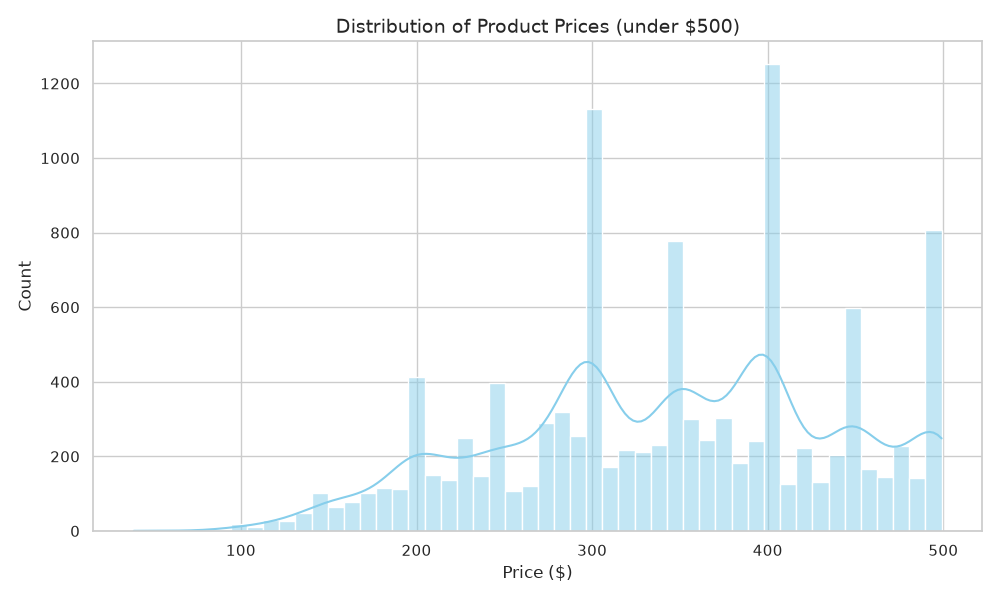
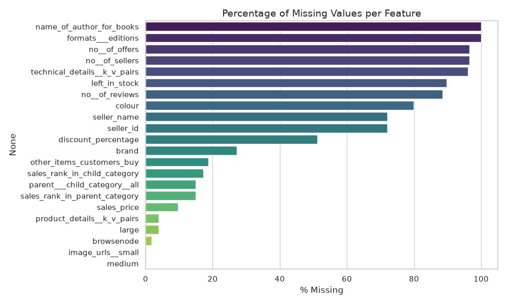
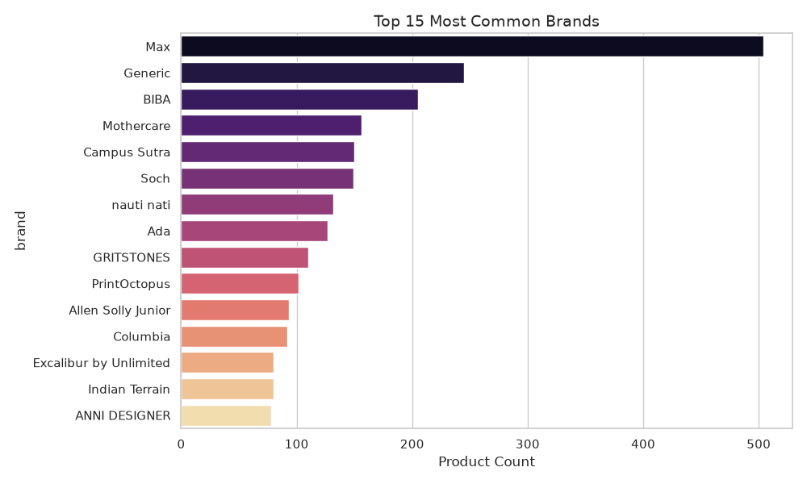

# Exploratory Data Analysis (EDA) & Design Decisions

This folder contains the data analysis that drove the architectural and feature engineering decisions for the product similarity search system. The visuals explain *why* we handle the data the way we do.

---

## 1. Price Distribution & Normalisation

**Observation:** The price data is heavily right-skewed, with most products clustering between $0 and $100, but a long tail extending outwards.
**Decision:** We use a `MinMaxScaler` for numerical features (`sales_price`, `rating`, `discount_percentage`). 
- Without scaling, the FAISS engine (which uses L2 distance or inner product) would give disproportionate importance to price simply because its raw values (e.g., $150) are much larger than rating values (e.g., 4.5).
- By scaling to [0, 1] and then L2-normalising the final vector, all numerical features contribute fairly to the similarity score.

---

## 2. Handling Missing Data (The Sentinel Approach)

**Observation:** `item_weight` is missing in nearly 100% of the dataset. Other features like `sales_price` have negligible missing rates.
**Decision:** 
- For features with low missing rates (e.g., `sales_price`), we impute using the **median** to prevent outliers from skewing the imputation.
- For `item_weight`, since it's almost entirely absent, we assign a sentinel value (`999999999`) in the `config.py` and effectively ignore it in the dense feature vector. This prevents the model from matching products purely because they *both* lack a weight.

---

## 3. High-Cardinality Categoricals (Brands & Colors)

**Observation:** The dataset contains a massive "long tail" of thousands of rare brands and colors, but a few top brands dominate the distribution.
**Decision:** We implement a **Top-N Bucket** strategy combined with `OneHotEncoder`.
- Instead of creating a 5,000-dimensional sparse vector for every unique brand (which would dilute the text embeddings and slow down search), we only keep the top 100 brands (configurable via `TOP_N_BRANDS`).
- All other brands fall into an "Other" bucket.
- This creates a dense, compact feature vector that perfectly balances precision with memory efficiency.

---

## 4. Text Feature Selection (Token Limits)

**Observation:** The `categories` column often contains full breadcrumb trails (e.g., "Clothing, Shoes & Jewelry | Women | Clothing | Tops, Tees & Blouses | Blouses & Button-Down Shirts"). Some products have over 300 words of breadcrumbs.
**Decision:** Sentence-BERT models have a strict 512-token context window limit.
- We truncate the categories to the first 3 tokens and `meta_keywords` to 150 characters.
- This ensures the most important semantic signals (product name, brand, core category) are never truncated by the transformer model, maximizing the quality of the 384-dimensional text embeddings.
